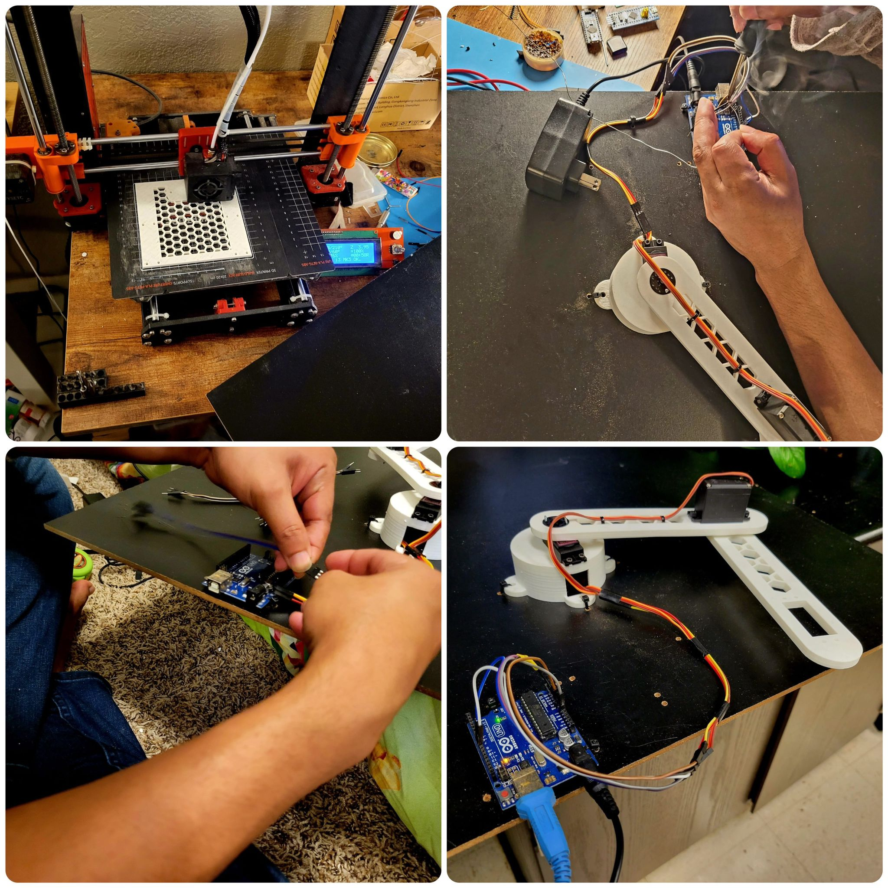
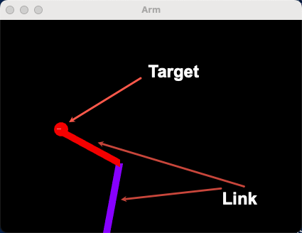

## RLScara Project

[](https://github.com/psf/black)
[](https://www.python.org/)
[](https://github.com/tensorflow/tensorflow/releases/tag/v2.2.0)


[](https://youtu.be/vW3J3VzC5Ac)

### Description

In this work, we develop a dynamic and scalable virtual environment for the Scara robot where the physical robot can be easily defined and extended by adding more links. We use the DDPG(Deep Deterministic Policy Gradient) algorithm to let the robot learn the task of inverse kinematics, which is, actuating different joints to reach a target object where the location of the target object is known. Full documentation can be found [HERE](https://haruiz.github.io/rl-project/) 

In addition, in order to test our model in the real world, we designed and developed a scaled version of a Scara robot using 3d printing and Arduino.

Our Scara robot consists of cascadable joints, which means the joints can be repeated to increase the degrees of freedom. We have tested the system with a Scara robot consisting of 2 links and two independent joints.

### Arduino based - Scara Robot Platform

We designed a scara robot using Solidworks. The links are designed in such a way so that they can be cascaded on demand. Hence, the links are modular and can be chained, thus, increasing and decreasing the degrees of freedom is easy to attain with such a structure. The length of each link is 150mm. However, our parametric design approach enables to change the length before 3D printing. Each of the links can have one or two joints. If a link is parent of another link, then it has two joints, else one. The joints are revolute joints with a [0,pi] range of angle.



### 2D simulated - Scara Robot Platform
For this project, we have also developed a digital twin environment of the Scara robot platform. It allow us to visualize and evaluate how the model performs in a virtual environment. Users can arbitrarily customize and dynamically add links to the robot arm and customize the angle boundaries for each connection. The simulation environment was developed using `pyglet`. 

**Note:** To add a target object or move it around the environment, click with the mouse at any location




All the documentation can be found here: [docs](https://haruiz.github.io/rl-project)

### Project Layout

- `3D models/`: 3D models folder. contains all the artifacts generated to build the 3d printed based arm platform
- `docs/` : Documentation folder
- `arduino/` : Arduino sketch code to control the arm platform
- `py/` : Python code generated to build the arm platform.

    **core classes**

    - `arm_controller.py` : Arm controller, it contains the class to control the arm platform.
    - `arm_env.py` : RL environment, it contains the class to build the RL environment
    - `arm_rl_model.py` : Arm model, it contains the class to build the RL model. For this project we used and implementation of the DDPG algorithm
    - `main.py` : Application entry point, this script should be used to train, evaluate the model, and  for rendering the simulation environment.
    
    **utils**

    - `arduino_utils.py` : Arduino utils, it contains some functions and classes to control the Arduino board.
    - `math_utils.py` : Math utils, it contains some functions and classes to perform some math operations.
    - `plot_utils.py` : Plot utils, it contains some functions and classes to plot the training results.

### Installation

For running the app, we recommend creating a virtual environment. The dependencies could be installed using `pip` or `poetry`.

- Using pip

run the command.

```bash
cd py
pip install -r requirements.txt
```

- Using poetry

For poetry users, use the command `poetry install`. 

Either way, both commands need to be executed from the `py` folder.

```
cd py
poetry install
```

## Usage

### Training

To train the model, use the command `python main.py train`. This command will train the model and save the parameters in the `py` folder.

### Evaluation

To evaluate the model, use the command `python main.py evaluate`. This command will load the model parameters from the `py` folder and evaluate the model.

### Simulation

To render the simulation environment, use the command `python main.py render`. This command will load the model parameters from the `py` folder and render the simulation environment in inference mode.

All the simulation and training parameters can be modified in the `main.py` file.

```python
# Simulation parameters
ENV_SIZE = Size2D(300, 300)
ARM_ORIGIN = Point2D(ENV_SIZE.width / 2, 0)
N_LINKS = 2
LINK_LENGTH = 100
MAX_EPISODES = 900
MAX_EP_STEPS = 300
```

## Group Members

<a href="https://github.com/abulalarabi">
  
</a>
<a href="https://github.com/haruiz" >
  
</a>


